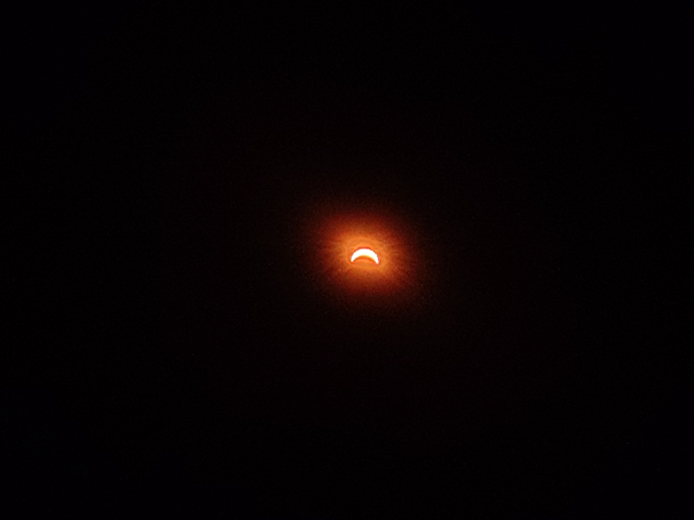

The view from right here, right now:

Looking at the sun through this old pair of eclipse-watching glasses,[^1] I'm reminded of someone[^2] who once quipped that a solar eclipse -- especially a full one -- is a planetary phenomenon worthy of a visit by alien tourists: 

[^1]: Made for the Shetland's Partial Solar Eclipse, 10 June 2021, these cardboard glasses (plus a second pair!) came as part of an 'Activity Pack' containing eclipse "recipes", information about the eclipse in Shetland, instructions on how to watch the eclipse with a cardboard box over the head (why would I? I already have the glasses...), history of eclipses in Shetland, competition, quizzes, and a picture to colour. All for the bargain price of £5.00

[^2]: It was a long time ago; don't ask me who it was.

After all, the idea that a planet's natural satellite looks the **exact same size** as its star is no less than mind-boggling. Seriously, what are the odds?[^3]

[^3]: Apparently estimated to be less than 0.1% at any given point in a system's lifespan.

Sadly, this rare phenomenon is only temporary: In roughly 600 million years, the moon (which is currently slowly receding by 3.8cm per year) will be too distant to fully cover the sun -- ending total solar eclipses on earth forever.

## Postscript

A Telegraph report about "a surge in colander sales for viewing the eclipse" prompted reader Valerie K. from Winterslow, Wiltshire, to ask (Letters to the Editor; Friday, August 14) the obvious question: How do they drain their pasta?