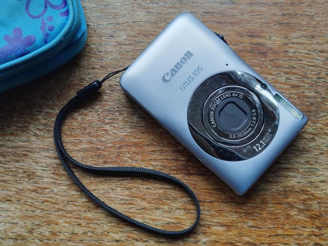

[[Posted](https://x.com/ArielMessing/status/2031650553340555507) sans-title[^1] on 𝕏, 11/3/26]

[^1]: A _panacea_ is a hypothetical remedy for all diseases, illnesses, or a universal solution to any given problem. Originally from ancient Greek, the word combines _pan_ ("all") and _akos_ ("cure"). In Greek mythology, [Panacea](https://en.wikipedia.org/wiki/Panacea) was the goddess of universal health, daughter of Asclepius, the snake-entwined staff-bearing medicine god.

I recently revived an old Canon pocket camera, and from now on, low-res photos -- grainy and lens-flared -- are my whole personality.

By '_revived_' I mean I found a compatible charger, charged the camera for a bit, then switched it on. The battery died **instantly**, and the lens got stuck halfway out.

As it turns out, this is a known issue with the model (?) [Edit: with pocket cameras in general, and a reason why they sadly dropped out of favour.]

Buried in some ancient technical forum, the kind you actually have to page through, I found a post suggesting a practically jury-rigged[^2] solution:

[^2]: In the original Hebrew I used the much more accurate Kishonism, "_פרטאצ'י_" (Partatchi) -- lit., "in the nature of Partachia." Based on a Yiddish slang word describing a sloppy, incompetent worker, and popularised by the Israeli legendary writer [Ephraim Kishon](https://en.wikipedia.org/wiki/Ephraim_Kishon), this fictionally satirical country personifies a mindset of systemic unprofessionalism, chaotic improvisation, and aggressive corner-cutting. סמוך! (Trust me!)

Drain the battery, charge it fully, and restart it while -- I am not speaking in metaphors here -- **giving it a proper whack flat on the side** in the hope that the shock would reset the thingamajig.

And the best part: this bit of [percussive maintenance](https://en.wiktionary.org/wiki/percussive_maintenance) actually worked (!!)

(I am well aware of the irony of such a post, and yet.)
